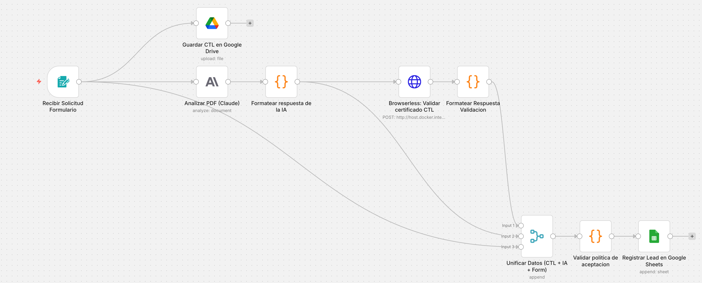

# Prueba Técnica: Automatización de Filtrado de Leads con IA y Web Scrapping - Fintech Inmobiliaria

## 1. Introducción y Propósito
Este proyecto presenta un prototipo de automatización end-to-end diseñado para optimizar el embudo de ventas de una fintech de préstamos con garantía hipotecaria. El sistema evalúa, valida y clasifica prospectos en tiempo real, integrando IA generativa y validación de fuentes oficiales mediante web scraping para mitigar riesgos operativos y financieros.

---

## 2. Política de Aceptación (Lógica de Negocio)

### A. Evaluación Financiera
* **Loan-to-Value (LTV):** $(\text{Monto solicitado} / \text{Valor comercial}) \times 100$.
* **Cobertura de Ingresos (LTI):** $(\text{Ingresos mensuales} \times 12 / \text{Monto solicitado}) \times 100$.
  * *Nota: Mide la solidez del ingreso anual frente al capital total solicitado.*

### B. Clasificación de Viabilidad
| Categoría | Criterios | Color en Sheet |
| :--- | :--- | :--- |
| **Altamente Viable** | LTV < 30%, LTI > 80%, Sin Embargos. | **Verde** |
| **Viable** | LTV 30%-50%, LTI 40%-80%, Sin Embargos. | **Amarillo** |
| **No Viable** | LTV > 50%, LTI < 40%, Con Embargos o PIN Inválido. | **Rojo** |

---

## 3. Implementación Técnica

### A. Stack Tecnológico y APIs
* **Orquestador (n8n):** Flujo modular que gestiona la captura, procesamiento y persistencia de datos.
* **IA de Extracción (Claude 4.5 Haiku):** Se utiliza la API de **Anthropic** para extraer datos estructurados (PIN, Matrícula, Propietarios, Embargos) en formato JSON. El modelo está instruido para procesar documentos complejos, incluyendo **escaneos de baja resolución** y anotaciones manuscritas.
* **Google Workspace API (OAuth2):** 
    * **Google Drive:** Guardado automático del CTL bajo la nomenclatura `cedula_direccion.pdf`.
    * **Google Sheets:** Base de datos centralizada con formato condicional.
    * **Gmail:** Sistema de alertas automáticas para notificar fallos técnicos.

### B. Validación Real de Garantía (Web Scraping)
Para asegurar la autenticidad del Certificado de Tradición y Libertad (CTL), el sistema consulta la fuente oficial:
* **Plataforma:** [SNR - Validación de Certificados](https://certificados.supernotariado.gov.co/certificado/external/validation/validate.snr).
* **Infraestructura (Browserless):** Se implementó un contenedor **Docker** para ejecutar la navegación automatizada.
    * **Razón técnica:** Permite delegar el renderizado del navegador a un entorno optimizado, evitando bloqueos por falta de dependencias gráficas en el servidor de n8n.
    
**Comando de ejecución del contenedor:**

docker run -d \
  -p 3000:3000 \
  --name browserless \
  --restart always \
  -e "MAX_CONCURRENT_SESSIONS=10" \
  browserless/chrome:latest

### C. Motor de Lógica y Normalización
* **JavaScript:** Un nodo de código centraliza los cálculos de LTV/LTI y normaliza las cédulas extraídas para asegurar comparaciones exactas entre el formulario y el documento legal, eliminando inconsistencias por caracteres especiales o formatos de texto.

---

## 4. Casos de Prueba (Escenarios)

#### Escenario 1: NO VIABLE
* **Solicitante:** `JUAN NEGATIVO` | **Cédula:** `101010`
* **Dirección:** `Bogotá`
* **Financiero:** Ingresos `$2000000` | Monto `$150000000` | Valor `$200000000`.
* **Resultado:** **NO VIABLE** (Exceso LTV 75%, Cobertura LTI 16% insuficiente y presencia de embargo activo en el CTL).

#### Escenario 2: VIABLE
* **Solicitante:** `MARIA VIABLE` | **Cédula:** `202020`
* **Dirección:** `Medellín`
* **Financiero:** Ingresos `$3500000` | Monto `$40000000` | Valor `$100000000`.
* **Resultado:** **VIABLE** (LTI 105% y LTV del 40%, perfil de riesgo moderado aceptable bajo política).

#### Escenario 3: ALTAMENTE VIABLE
* **Solicitante:** `RICARDO EXCELENTE` | **Cédula:** `303030`
* **Dirección:** `Cali`
* **Financiero:** Ingresos `$10000000` | Monto `$30000000` | Valor `$150000000`.
* **Resultado:** **ALTAMENTE VIABLE** (LTV 20% y LTI 400%, solidez financiera total y respaldo patrimonial óptimo).

*Nota: Los PINs 222222222222222 y 333333333333333 están habilitados en el código como verificados para fines de esta prueba.*

---

## 5. Conclusión
Se lograron satisfactoriamente todos los requisitos de la prueba, entregando una solución funcional que automatiza el análisis de riesgos, elimina la carga operativa manual y centraliza la información para la toma de decisiones inmediata mediante alertas visuales en tiempo real.